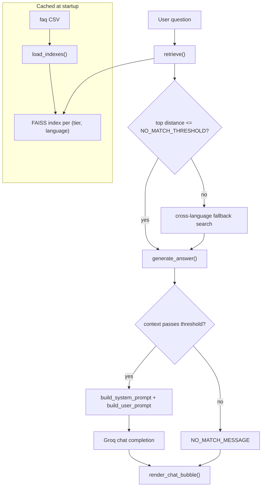

# RAFIKI - Architecture

RAFIKI is a bilingual (English / Kiswahili) financial FAQ chatbot for the
Tanzanian market. It answers user questions using retrieval-augmented
generation (RAG): questions are matched against a curated FAQ knowledge base
scoped to the user's profile, and a Groq-hosted LLM generates a grounded answer
from the retrieved context.

The entire application is a single Streamlit script: [`streamlit_app.py`](streamlit_app.py).

## Tech stack

| Concern | Library |
| --- | --- |
| Web UI / app runtime | Streamlit |
| Vector search | FAISS (`faiss-cpu`) |
| Embeddings | `sentence-transformers` (`paraphrase-multilingual-MiniLM-L12-v2`) |
| LLM generation | Groq (`llama-3.3-70b-versatile`) |
| Data handling | pandas, numpy |
| Secrets / config | `python-dotenv`, `st.secrets` |

## Request / data flow

## Layers

### 1. Data load and index build

`load_indexes()` (decorated with `@st.cache_resource`, so it runs once per
server process) does the following:

- Reads the dataset from `DATA_PATH` (defaults to `faq_qns22_csv.csv`, override
  with the `SM01_DATA_PATH` env var).
- Validates required columns: `pair_id`, `user_tier`, `language`, `topic`,
  `source`, `keywords`, `question`, `answer`, `answer_context`.
- Repairs common UTF-8-as-Latin1 mojibake (`_fix_mojibake`).
- Builds an `embed_text` field (question + keywords + answer + truncated
  context) and encodes it with the sentence-transformer model.
- Groups rows by `(user_tier, language)` and builds one `IndexFlatL2` FAISS
  index per group, returning `{(tier, language): (index, dataframe_group)}`.

The Groq client is created once via `get_groq_client()` (also cached).

### 2. Retrieval

- `_search_index()` embeds the query and runs an L2 nearest-neighbour search in
  the index for the active `(tier, language)`, returning the top-`k` rows with
  their distances.
- `retrieve()` returns the in-language results when the best distance is within
  `NO_MATCH_THRESHOLD` (32). Otherwise it tries the other language as a
  fallback and keeps whichever is closer. This lets a user phrasing a question
  in one language still match well-indexed content in the other.

### 3. Prompt construction and generation

- `build_system_prompt()` injects a tier-specific persona (`TIER_PERSONA`) and a
  hard language rule (answer only in the selected language), plus grounding
  rules (answer only from context, cite the source institution, ask for
  clarification when unclear).
- `build_user_prompt()` formats the retrieved contexts into a single context
  block followed by the question.
- `generate_answer()` re-checks the retrieval threshold (returns
  `NO_MATCH_MESSAGE` if nothing qualifies), appends the last `HISTORY_TURNS`
  (10) messages for follow-up context, calls Groq at `temperature=0.3`, and
  handles `RateLimitError` / `APIError` with localized fallback messages.

## UI and state model

State lives in `st.session_state`. Key fields:

| Key | Purpose |
| --- | --- |
| `messages` | Full role/content history sent to the LLM |
| `display_messages` | Messages rendered as chat bubbles |
| `tier` / `language` | Current profile selection (widget-backed) |
| `last_tier` / `last_language` | Detect profile changes to reset the chat |
| `theme_mode` | `system` / `light` / `dark` |
| `pending_query` | A starter-chip question awaiting the empty-state fade |
| `fading_empty` / `_fade_armed` / `_queued_query` | Empty-to-chat fade transition |
| `awaiting_answer` | A user turn waiting for the assistant response |
| `chat_has_started` | Whether the first message has been sent |

Flow highlights:

- **Empty state**: when there are no messages, a hero title, localized starter
  chips (`STARTER_QUESTIONS` keyed by `(tier, language)`), and a disclaimer are
  shown.
- **Fade transition**: the first question triggers a brief fade-out of the empty
  state before the chat appears. This is driven by `_fade_exit_timer()`, an
  `@st.fragment(run_every=...)` that arms on one tick and completes on the next
  (`_complete_empty_fade`), then reruns.
- **New chat**: the sidebar "New chat" button clears all chat-related session
  state and reruns. Changing tier or language clears the chat the same way.
- **Bubbles**: `render_chat_bubble()` renders user bubbles right-aligned and
  assistant bubbles left-aligned with an avatar, via inline-styled HTML.
- **Display sanitation**: `format_display()` is UI-only (it normalizes dashes);
  it never affects retrieval or the text sent to the LLM.

## Theming

Streamlit's built-in theming is supplemented with custom CSS:

- `build_app_css(theme_mode)` assembles the full stylesheet: a shared block plus
  theme-specific rules from `_theme_rules`, `_pill_css` (language segmented
  control), and `_theme_tile_css` (theme picker tiles).
- For `light` / `dark` the matching block is emitted directly. For `system`,
  both blocks are emitted wrapped in `@media (prefers-color-scheme: ...)`.
- `inject_theme_attribute()` sets a `data-theme` attribute on `.stApp` (via a
  small script) so the `[data-theme="light"]` overrides in
  `_light_theme_overrides()` apply, and keeps it in sync with the OS preference
  in `system` mode.
- `inject_ui_animations()` injects the fade keyframes into the parent document
  (Streamlit can strip some `st.markdown` styles), and `apply_chat_fade_in()`
  animates the newest bubble.

## Configuration and deployment

- **API key**: read from `st.secrets["GROQ_API_KEY"]` (Streamlit Cloud) with a
  fallback to the `GROQ_API_KEY` environment variable / `.env` (local). The app
  stops with an error if neither is set.
- **Dataset path**: `SM01_DATA_PATH` env var, default `faq_qns22_csv.csv`.
- **Streamlit theme base**: `.streamlit/config.toml`.
- **Run locally**: `streamlit run streamlit_app.py`. **Deploy**: push to GitHub
  and deploy via Streamlit Community Cloud, setting `GROQ_API_KEY` in Secrets.

## Known issues and recommendations

- **`config.toml` defines both `[theme]` and `[theme.dark]`.** Because both are
  declared, several Streamlit components follow the OS color scheme rather than
  the in-app selection. This "theme bleed" is the root cause of the heavy
  `!important` CSS and the per-theme / `@media` workarounds in `_pill_css` and
  `_theme_tile_css`. A cleaner long-term fix is to drive theming from a single
  source of truth so these overrides can be simplified or removed. _Still open:
  this is an architectural change with appearance risk and is intentionally
  deferred._

### Resolved

- **`requirements.txt` is now pinned.** All dependencies are pinned to the
  known-good versions in use (`streamlit==1.58.0`, `pandas==3.0.3`, etc.).
- **`load_indexes()` Excel support is now declared.** `openpyxl==3.1.5` is in
  `requirements.txt`, so the `pd.read_excel` branch works for `.xlsx`/`.xls`
  input as well as the default CSV path.
- **Fade keyframes are deduplicated.** The `@keyframes` and `.rafiki-fade-out`
  rule now live only in `inject_ui_animations()` (the reliable parent-document
  injection); the duplicate copy was removed from the shared CSS string.
